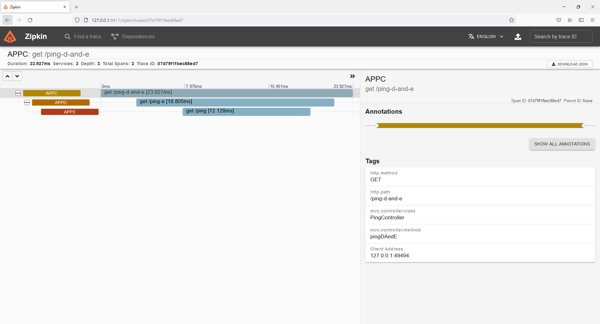
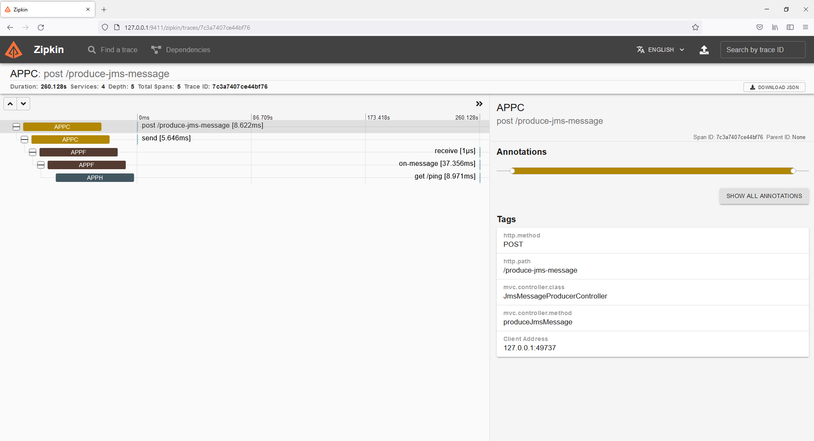
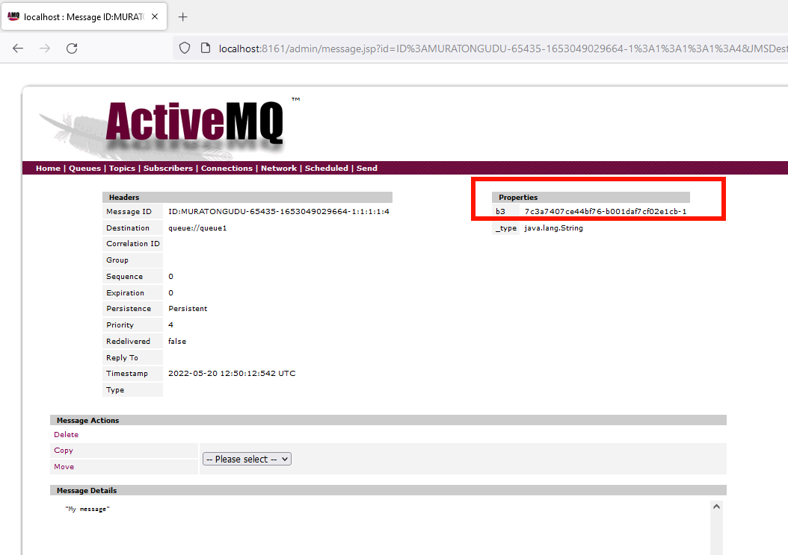
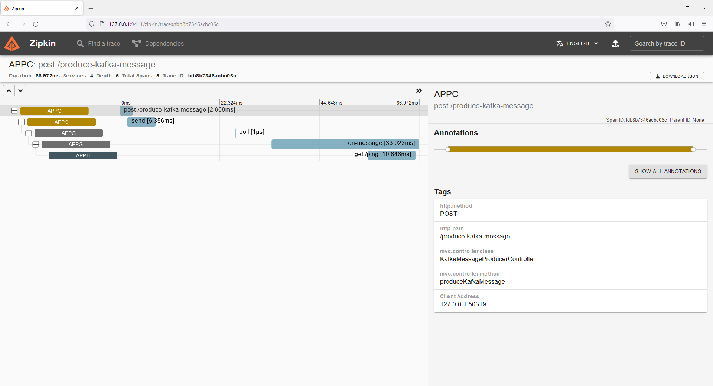
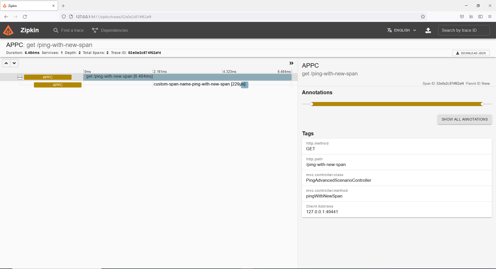
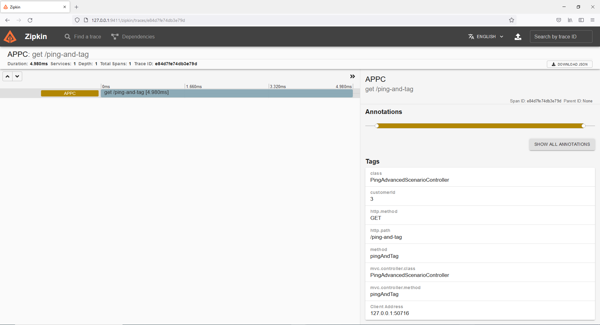
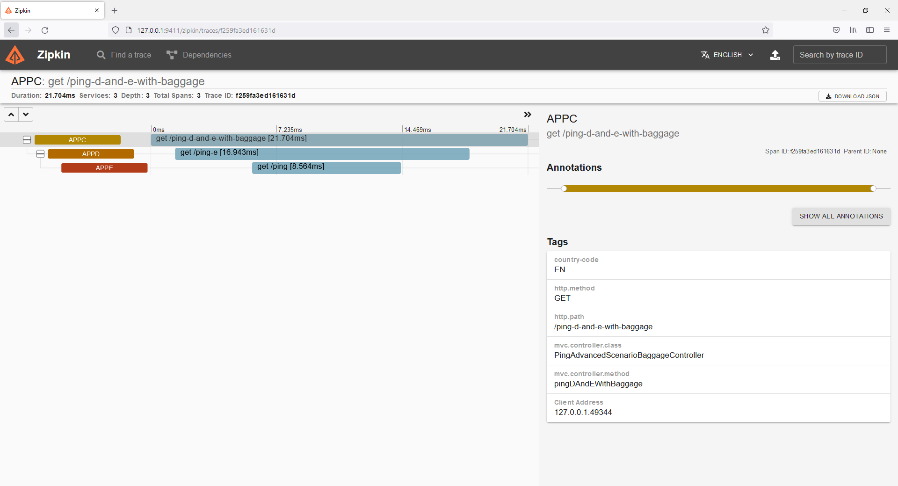

# Distributed tracing demo for async and sync flows (HTTP, JMS, Kafka)

Distributed tracing demos in a tech stack which contains web applications and a message broker (ActiveMQ) and an event streaming platform (Kafka).

The web applications in the demo use Java, Maven and Spring Boot. 

Zipkin is used as a distributed tracing system in this demo, but it is possible to switch alternatives.

# Tech stack

| App      				| Address - Port       																 |
| --------------- | -------------------- 																	 |
| Zipkin Web UI   | http://127.0.0.1:9411     																 |
| Kafka           | 9092                      																 | 
| ActiveMQ Web    | http://localhost:8161 (admin/admin)                                                      |
| app A           | http://localhost:9090     																 |
| app B           | http://localhost:9091     																 |
| app C           | http://localhost:9093     																 |
| app D           | http://localhost:9094     																 |
| app E           | http://localhost:9095     																 |
| app F           | http://localhost:9096     																 |
| app G           | http://localhost:9097     																 |
| app H           | http://localhost:9098     																 |

# Testing the demo

## 1. Start Zipkin, ActiveMQ, Kafka, Zookeper

``docker-compose up``

## 2. Start applications

You can start applications by `mvn spring-boot:run`. Please start them all.

You can check configuration files (application.yml) in the "resources" folder of applications. (please note that: putting a configuration file in a codebase is a bad practice, I did it here on purpose to make demo process easy.)

You can trigger Rest services in the AppC and test the cases below.

## Demo scenarios

### 1. Applications BEFORE using distributed tracing

> Flow: App A -> B
>>       GET http://localhost:9090/ping-b

- Check the log files, there is nothing to correlate the requests in the logs files of app A and B.

appA logs

    2022-05-20 16:10:19.155 TRACE 29952 --- [nio-9090-exec-1] o.s.web.servlet.DispatcherServlet        : GET "/ping-b", parameters={}, headers={host:[localhost:9090], connection:[Keep-Alive], user-agent:[Apache-HttpClient/4.5.13 (Java/11.0.11)], accept-encoding:[gzip,deflate]} in DispatcherServlet 'dispatcherServlet'

appB logs

    2022-05-20 16:10:20.273 TRACE 20848 --- [nio-9091-exec-1] o.s.web.servlet.DispatcherServlet        : GET "/ping", parameters={}, headers={accept-encoding:[gzip], user-agent:[ReactorNetty/1.0.18], host:[localhost:9091], accept:[*/*]} in DispatcherServlet 'dispatcherServlet'

### 2. Distributed tracing demo with web applications

> Flow: App C -> D -> E
>>       GET http://localhost:9093/ping-d-and-e

After making the rest call, please;

- Check Zipkin UI for traces and dependencies
- Check the log files, find the headers starting with "x-b3-" prefix

appC logs

    2022-05-20 15:41:52.690 TRACE [appC,07d79f1fbec88ed7,07d79f1fbec88ed7] 30276 --- [nio-9093-exec-8] o.s.web.servlet.DispatcherServlet        : GET "/ping-d-and-e", parameters={}, headers={host:[localhost:9093], connection:[Keep-Alive], user-agent:[Apache-HttpClient/4.5.13 (Java/11.0.11)], accept-encoding:[gzip,deflate]} in DispatcherServlet 'dispatcherServlet'

appD logs

    2022-05-20 15:41:52.695 TRACE [appD,07d79f1fbec88ed7,ffcf40fa83a35645] 32540 --- [nio-9094-exec-4] o.s.web.servlet.DispatcherServlet        : GET "/ping-e", parameters={}, headers={accept-encoding:[gzip], user-agent:[ReactorNetty/1.0.18], host:[localhost:9094], accept:[*/*], x-b3-traceid:[07d79f1fbec88ed7], x-b3-spanid:[ffcf40fa83a35645], x-b3-parentspanid:[07d79f1fbec88ed7], x-b3-sampled:[1]} in DispatcherServlet 'dispatcherServlet' 

appE logs

    2022-05-20 15:41:52.705 TRACE [appE,07d79f1fbec88ed7,e75fea1e325d383b] 23772 --- [nio-9095-exec-8] o.s.web.servlet.DispatcherServlet        : GET "/ping", parameters={}, headers={accept:[text/plain, application/json, application/*+json, */*], x-b3-traceid:[07d79f1fbec88ed7], x-b3-spanid:[e75fea1e325d383b], x-b3-parentspanid:[ffcf40fa83a35645], x-b3-sampled:[1], user-agent:[Java/11.0.11], host:[localhost:9095], connection:[keep-alive]} in DispatcherServlet 'dispatcherServlet'

### 3. Distributed tracing demo with web applications and a message broker (ActiveMQ) - JMS

Our goal: Keeping the relation of the requests in a distributed environment when we add protocols other than HTTP (like JMS) to our stack. This is also an example applying distributed tracing to asynchronous flows.

> Flow: App C -> ActiveMQ -> F (Consumer) -> H 
>>       POST http://localhost:9093/produce-jms-message

- Shutdown appF 
- Make the rest call, check messages in the ActiveMQ queue -named queue1-, find the property named "b3".
- Start appF
- Check Zipkin UI for traces and dependencies
- Check the log files, find the headers starting with "x-b3-" prefix

appC logs

    2022-05-20 15:50:12.541 TRACE [appC,7c3a7407ce44bf76,7c3a7407ce44bf76] 30276 --- [nio-9093-exec-6] o.s.web.servlet.DispatcherServlet        : POST "/produce-jms-message", parameters={}, headers={content-length:[0], host:[localhost:9093], connection:[Keep-Alive], user-agent:[Apache-HttpClient/4.5.13 (Java/11.0.11)], accept-encoding:[gzip,deflate]} in DispatcherServlet 'dispatcherServlet'

appF logs

    2022-05-20 15:54:32.644  INFO [appF,7c3a7407ce44bf76,dd37cf3508babe82] 2436 --- [ntContainer#0-1] com.example.appf.jms.JmsMessageConsumer  : Message payload <My message>

appH logs

    2022-05-20 15:54:32.662 TRACE [appH,7c3a7407ce44bf76,aaf844142013f04a] 27568 --- [nio-9098-exec-5] o.s.web.servlet.DispatcherServlet        : GET "/ping", parameters={}, headers={accept:[text/plain, application/json, application/*+json, */*], x-b3-traceid:[7c3a7407ce44bf76], x-b3-spanid:[aaf844142013f04a], x-b3-parentspanid:[dd37cf3508babe82], x-b3-sampled:[1], user-agent:[Java/11.0.11], host:[localhost:9098], connection:[keep-alive]} in DispatcherServlet 'dispatcherServlet'

### 4. Distributed tracing demo with web applications and an event streaming platform (Kafka) - Kafka

Our goal: Keeping the relation of the requests in a distributed environment when we add protocols other than HTTP (like Kafka) to our stack. This is also an example applying distributed tracing to asynchronous flows.

> Flow: App C -> Kafka -> G (Consumer) -> H
>>      POST http://localhost:9093/produce-kafka-message

After making the rest call, please;

- Check Zipkin UI for traces and dependencies
- Check the log files, find the headers starting with "x-b3-" prefix.

appC logs

    2022-05-20 16:00:28.178 TRACE [appC,fdb8b7346acbc06c,fdb8b7346acbc06c] 30276 --- [nio-9093-exec-7] o.s.web.servlet.DispatcherServlet        : POST "/produce-kafka-message", parameters={}, headers={content-length:[0], host:[localhost:9093], connection:[Keep-Alive], user-agent:[Apache-HttpClient/4.5.13 (Java/11.0.11)], accept-encoding:[gzip,deflate]} in DispatcherServlet 'dispatcherServlet'

appG logs

    2022-05-20 16:00:28.214  INFO [appG,fdb8b7346acbc06c,d3e2a2a6ebf0cbae] 21848 --- [ntainer#0-0-C-1] c.e.appg.kafka.KafkaMessageConsumer      : Received Message in group foo: My message

appH logs

    2022-05-20 16:00:28.237 TRACE [appH,fdb8b7346acbc06c,f95ea1b1f2df516e] 27568 --- [nio-9098-exec-7] o.s.web.servlet.DispatcherServlet        : GET "/ping", parameters={}, headers={accept:[text/plain, application/json, application/*+json, */*], x-b3-traceid:[fdb8b7346acbc06c], x-b3-spanid:[f95ea1b1f2df516e], x-b3-parentspanid:[d3e2a2a6ebf0cbae], x-b3-sampled:[1], user-agent:[Java/11.0.11], host:[localhost:9098], connection:[keep-alive]} in DispatcherServlet 'dispatcherServlet'

### 5. [Advanced] - Create a nested span in an app

> Flow: App C
>>      GET http://localhost:9093/ping-with-new-span

After making the rest call, please;

- Check Zipkin UI for traces, you'll see a nested span for app C.

appC logs

    2022-05-20 15:39:54.498 TRACE [appC,52e0e2c874f62af4,52e0e2c874f62af4] 30276 --- [nio-9093-exec-6] o.s.web.servlet.DispatcherServlet        : GET "/ping-with-new-span", parameters={}, headers={host:[localhost:9093], connection:[Keep-Alive], user-agent:[Apache-HttpClient/4.5.13 (Java/11.0.11)], accept-encoding:[gzip,deflate]} in DispatcherServlet 'dispatcherServlet'

### 6. [Advanced] - Baggage fields (Tags) by annotations

> Flow: App C
>>      GET http://localhost:9093/ping-and-tag?customerId=3

After making the rest call, please;

- Check Zipkin UI for traces, you'll see a tag named "customerId" with value: "3"

appC logs

    2022-05-20 16:20:30.486 TRACE [appC,e84d7fe74db3e79d,e84d7fe74db3e79d] 30276 --- [nio-9093-exec-4] o.s.web.servlet.DispatcherServlet        : GET "/ping-and-tag?customerId=3", parameters={customerId:[3]}, headers={host:[localhost:9093], connection:[Keep-Alive], user-agent:[Apache-HttpClient/4.5.13 (Java/11.0.11)], accept-encoding:[gzip,deflate]} in DispatcherServlet 'dispatcherServlet'

### 7. [Advanced] - Baggage fields (Tags) by coding - Multiple calls

> Flow: App C -> D -> E
>>      GET http://localhost:9093/ping-d-and-e-with-baggage

After making the rest call, please;

- Check Zipkin UI for traces, you'll see a tag named "country-code" with value: "EN"
- Check the log files, find the header named "country-code"

appC logs

    2022-05-20 15:35:20.811 TRACE [appC,f259fa3ed161631d,f259fa3ed161631d] 30276 --- [nio-9093-exec-4] o.s.web.servlet.DispatcherServlet        : GET "/ping-d-and-e-with-baggage", parameters={}, headers={host:[localhost:9093], connection:[Keep-Alive], user-agent:[Apache-HttpClient/4.5.13 (Java/11.0.11)], accept-encoding:[gzip,deflate]} in DispatcherServlet 'dispatcherServlet'

appD logs

    2022-05-20 15:35:20.815 TRACE [appD,f259fa3ed161631d,7b9d92f81d75bf10] 32540 --- [nio-9094-exec-1] o.s.web.servlet.DispatcherServlet        : GET "/ping-e", parameters={}, headers={accept:[text/plain, application/json, application/*+json, */*], x-b3-traceid:[f259fa3ed161631d], x-b3-spanid:[7b9d92f81d75bf10], x-b3-parentspanid:[f259fa3ed161631d], x-b3-sampled:[1], country-code:[EN], user-agent:[Java/1.8.0_322], host:[localhost:9094], connection:[keep-alive]} in DispatcherServlet 'dispatcherServlet'

appE logs

    2022-05-20 15:35:20.823 TRACE [appE,f259fa3ed161631d,32e7a885398550c0] 23772 --- [nio-9095-exec-5] o.s.web.servlet.DispatcherServlet        : GET "/ping", parameters={}, headers={accept:[text/plain, application/json, application/*+json, */*], x-b3-traceid:[f259fa3ed161631d], x-b3-spanid:[32e7a885398550c0], x-b3-parentspanid:[7b9d92f81d75bf10], x-b3-sampled:[1], country-code:[EN], user-agent:[Java/11.0.11], host:[localhost:9095], connection:[keep-alive]} in DispatcherServlet 'dispatcherServlet'

# License 

This project is licensed under the terms of Apache license 2.0
